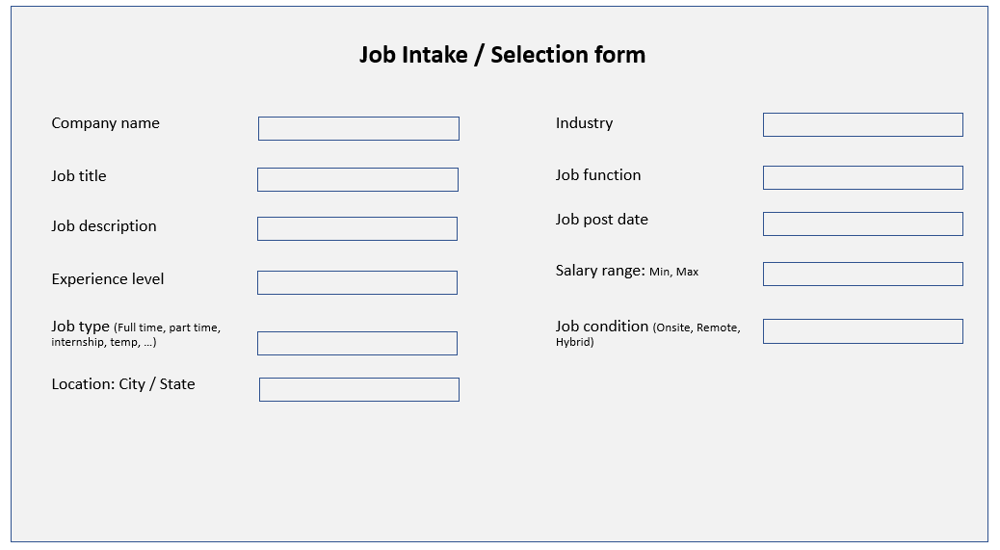

# Job-search-engine: Interactive Full-Stack Application

## Search for your favorite music artist!

Finding job is a chalenging task and students have a better chance of hiring for a job based on develped skill set. Collaborating ans sharing job information is helpful in our bootcamp community and improve change of employment for students. The current applicaiton allows users to enter a new job in the database using a front end webpage. It also provides a searching page to look for jobs and filtering based on job features. This application match jobs based on multiple criteria set by the user and list all available jobs that meet the criteria.

## User Story

As a job seeker I would like to use a search engine to find jobs based on my skill set. 

As a job seeker I would like to use a search engine to find jobs based on jobs specifications (Industry, job function, location, Salary range, Job type, Job condition, ... ). 

## Technologies used

Full-stack application using 
* Node.js, 
* Express.js, 
* RESTful API,
* Both GET and POST routes for retrieving and adding new data,
* Authentication (express-session and cookies),
* Protect API keys and sensitive information with environment variables,
* MySQL and the Sequelize ORM for the database,
* Handlebars.js, 
* MVC architecture,
* Heroku for deployment

## Contributions

Made by Nirali Parmar, Joshua Nelson, Jamie Olivas, and John Aslani, AKA MVC MVP Team.

## Screenshot

## Mockup

## Link to deployed akpplication

https://johnaslani.github.io/Crowdfunding-App/

## Link to GitHub repo:

https://github.com/johnaslani/Crowdfunding-App
